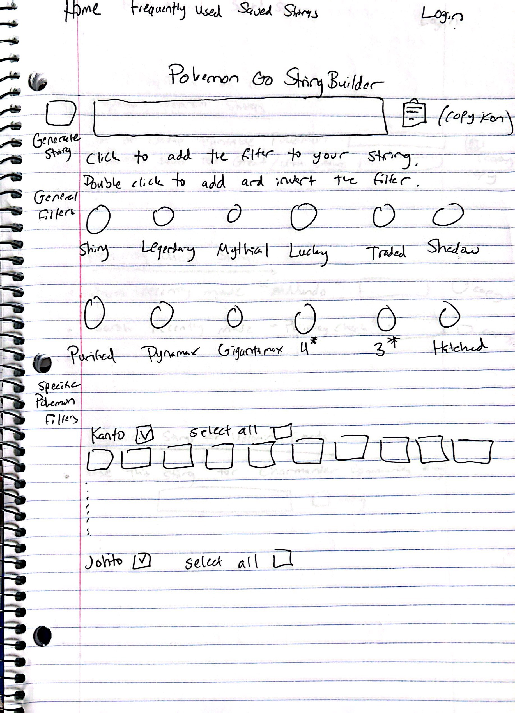
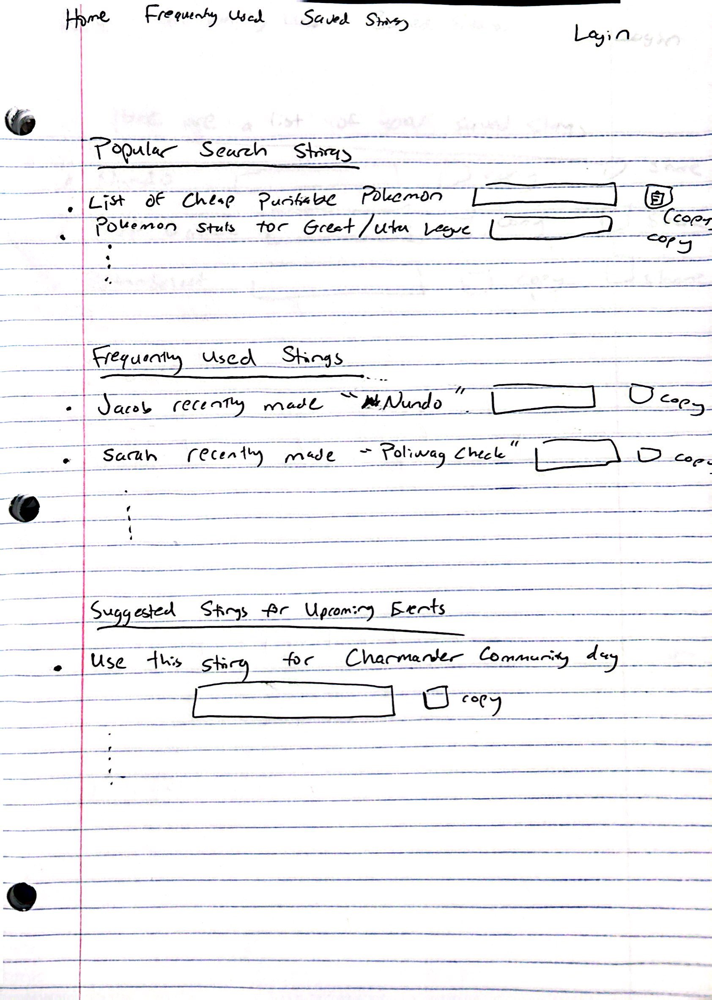
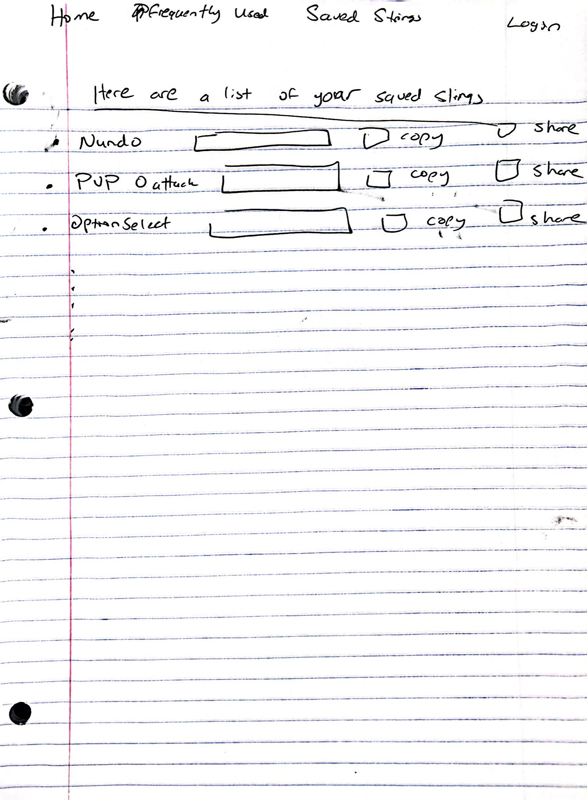

# CS260-Startup-Project
My goal in this startup is to make a working string generator for popular mobile game Pokemon Go.

## Specification Deliverable

### Elevator Pitch
If you have ever played Pokemon Go, you know how fun it is to catch and collect your favorite creatures. You also know how tedious and time consuming it can be to sort through your hundreds of Pokemon. With this website you will be able to skip that agonizing part and get right back to playing. This website will give you  the ability to quickly create, save and copy other's seach strings.

### Key Features
- Ability to create general search strings that include commonly used filters such as:
  - Shiny
  - Legendary
  - Mythical
  - Traded
  - Lucky
  - Dynamax
  - Gigantamax
  - Purified
  - Shadow
  - 4 Star
  - 3 Star
  - Hatched
- Ability to create very specific transfer commands (pick specifically which pokemon to include in each string)
- Ability to save your strings on a personal profile
- Ability to view strings others have made and be able to save/copy them

### Technologies
I am going to use the required technologies in the following ways:

- **HTML** - My project will include 3 pages:
  - Custom StringBuilder Page
  - Frequently Used String Page
  - Personal Profile Page
- **CSS** - My website will contain many  buttons that control filters for the string output. My CSS will make these buttons look pleasing to the eye.
- **Javascript/React** - My filter buttons will be given functionailty and interactivty with the user while they build their string. These buttons will remain in an on/off state until the generate string button is clicked. I'd also like to be able to invert a button by double-clicking it.
- **Web-Service** - In the Frequently Used page, I will call on another webpage that contains information on recent Pokemon Go events to be able to generate relevant and useful strings.
- **Authentication** - My website will include the ability to log in. 
Each profile will have the ability to save strings they have created or strings others have created.
- **Database Data** - Any string that is created and saved will be stored in the websites database.
- **Websocket Data** - On the Frequently Used page, users have the ability to see strings that others have shared.

